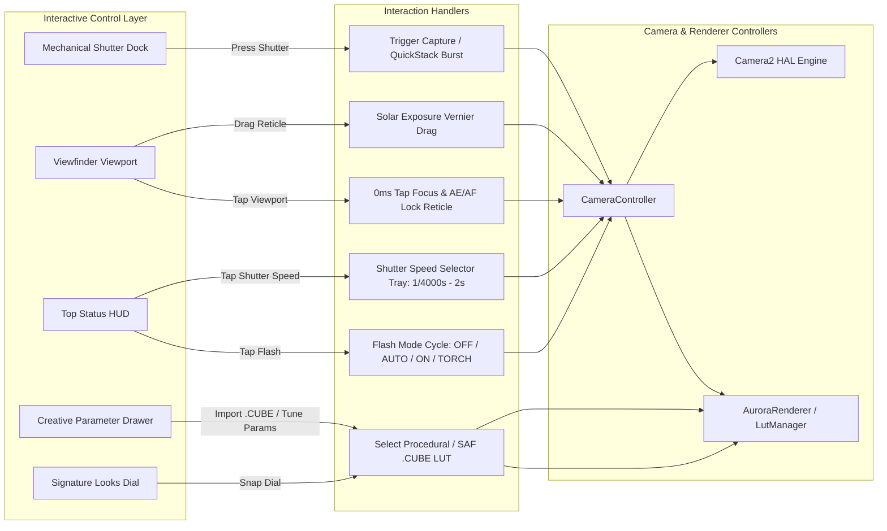

# AuroraCam

> Live double exposure, real-time procedural 3D LUT color grading, temporal echo, motion-only exposure, and light trail accumulation — rendered entirely on the GPU in the viewfinder before pressing the shutter.

AuroraCam is a cinema-grade, tactile creative camera application for Android built with **Jetpack Compose**, **direct Camera2 HAL integration**, and **OpenGL ES 3.0**.

---

## 🌟 Key Features

### 🎛️ Cinematic Photographic Control Surface
- **Obsidian & Warm Amber Design System:** Pure industrial camera aesthetics built on deep matte surfaces (`SurfaceDark` `0xFF0F1115`), hairline borders (`0xFF2B313D`), smoked glass scrims, monospaced technical readouts, and a dedicated **Leica Warm Amber** (`0xFFE5A00D`) accent.
- **Minimal Viewfinder Status HUD:** Positioned cleanly below system insets, presenting real-time telemetry:
  - **Quick Flash Selector:** Instant toggle on the main HUD (`[OFF]`, `[AUTO]`, `[ON]`, `[TORCH]`).
  - **Interactive Shutter Speed Selector:** Tap the active shutter speed to reveal a quick-select manual exposure tray (`AUTO`, `1/4000s` down to `2s`).
  - **Live Telemetry:** Dynamic indicators for ISO, EV offset, FPS, and RAW/HDR status.
- **Direct-Access Looks Snapping Dial:** Horizontal dial positioned above the shutter button for instant switching between analog film looks without opening menus.
- **Mechanical Shutter Dock:** 80dp tactile shutter with inner solid disc scale animations, 48dp squircle gallery preview thumbnail, and one-tap creative drawer access.
- **Compact Creative Menu:** Low-profile overlay sheet keeping the live viewfinder fully visible for framing while tuning parameters across `MODES`, `LOOKS`, `EFFECTS`, and `PRO` tabs.

---

### 🎨 Procedural & Hardware-Accelerated 3D LUT Tone Engine
- **Hardware-Accelerated 3D Textures:** Parses `.cube` files (17³, 33³, 64³ grid sizes) directly on the GPU using `GL_TEXTURE_3D` with trilinear filtering.
- **Procedural Film Look Generators:**
  - **Hasselblad (HNCS):** Hasselblad Natural Color Solution featuring medium-format tonal fidelity, natural skin tones, smooth rational asymptotic highlight shoulder ($x > 0.55$), and neutral shadow floor.
  - **Leica Character:** High micro-contrast Hermite S-curve, signature warm-amber midtone glow ($L = 0.45$), rich shadow depth, and vibrant color rendition.
  - **Fujifilm Classic Chrome:** Documentary contrast with deep shadow toe ($x^{1.22}$), muted sky teal/cyan shifts, earthy warm reds, and restrained saturation.
  - **Kodak Portra 400:** Iconic portrait negative film look with lifted matte blacks ($+0.035$), golden-peach skin tones, and ivory highlight roll-off.
  - **Aurora Warm:** Golden sunset warmth and gentle atmospheric glow.
  - **Monochrome & Chrome:** High-contrast street photography black & white and vintage chrome grades.
- **Custom LUT Import (`.CUBE`):** Seamlessly import external `.cube` grading LUTs from device storage via Android Storage Access Framework (SAF).
- **16-Bit Float HDR Pipeline:** High dynamic range intermediate framebuffers (`GL_RGBA16F`) preventing color banding in dark gradients and bright highlights.
- **Look Intensity & Halation Glow:** Real-time bloom/glow blur shader simulating vintage analog film halation around high-contrast edges.

---

### 🌀 Advanced GPU Creative Modes
- **📸 Standard & QuickStack Computational Burst:** High-speed 6-frame burst capture with phase-correlation spatial alignment and GPU temporal stacking for noise reduction in low-light scenes.
- **👥 Live GPU Double Exposure:** Two-stage multi-exposure pipeline with live viewfinder blending (Screen, Overlay, Add, Lighten, Multiply), opacity scrubber, and horizontal flip controls.
- **👻 Temporal Echo (Ghost Trails):** 3-frame GPU history ring buffer blending (`glBlitFramebuffer`) with exponential decay to produce vintage multi-image motion trails.
- **🏃 Motion-Only Exposure:** Real-time luminance frame-differencing shader pass isolating moving subjects from static backgrounds with adjustable motion thresholds.
- **✨ Light Trails Mode:** Ping-Pong accumulation FBO max/decay blend engine simulating long exposure light painting in real-time with instant reset controls.
- **🎯 Focus Peaking Pass:** High-pass Sobel filter edge detection highlighting in-focus planes in vibrant green overlay.

---

### 🎯 Precision Cinema Focus Reticle & Integrated Exposure Slider
- **Instant 0ms Tap-to-Focus:** Tap anywhere on the viewfinder to dynamically update Camera2 `CONTROL_AF_REGIONS` and `CONTROL_AE_REGIONS` with auto-focus trigger cycles.
- **Cinema-Grade Reticle:** Minimalist corner chamfered L-brackets with center targeting crosshair and target dot.
- **AE/AF Lock Capsule (`[AE/AF-L]`):** Reticle-mounted lock button to instantly pin exposure and focus distance.
- **Solar Vernier Exposure Ladder:** Precision vertical draggable solar ladder with 1/3-stop increments (-2.0 EV to +2.0 EV) that stays visible throughout active drag gestures.

---

### 📐 Framing & Aspect Ratio Formats
- **XPAN Panoramic (65:24):** True cinematic ultra-wide crop with orange viewfinder corner guides.
- **Square (1:1):** Classic medium format square framing with translucent letterboxing.
- **Standard (4:3):** Full sensor resolution capture.

---

## 🏛️ System & Rendering Architecture

### GPU Multi-Pass Pipeline

```mermaid
flowchart TD
    subgraph Camera_HAL [Camera2 HAL Stream]
        Sensor[Image Sensor Stream] -->|YUV_420_888 / OES| SurfaceTex[SurfaceTexture OES]
    end

    subgraph GPU_Pipeline [OpenGL ES 3.0 Multi-Pass Shader Engine]
        SurfaceTex -->|GL_TEXTURE_EXTERNAL_OES| BasePass[Base Pass: Texture Unpack & Transform]
        BasePass --> FBO_HDR[16-Bit Float HDR FBO (GL_RGBA16F)]
        
        FBO_HDR --> ModeRouter{Creative Mode Pass}
        ModeRouter -->|Standard / Burst| LUTPass[3D LUT Color Grade (GL_TEXTURE_3D)]
        ModeRouter -->|Double Exposure| BlendPass[Double Exposure FBO Blender]
        ModeRouter -->|Temporal Echo| EchoPass[History Ring Buffer (glBlitFramebuffer)]
        ModeRouter -->|Motion Only| MotionPass[Frame Differencing Pass]
        ModeRouter -->|Light Trails| AccumPass[Ping-Pong Accumulation FBO]
        
        BlendPass --> LUTPass
        EchoPass --> LUTPass
        MotionPass --> LUTPass
        AccumPass --> LUTPass
        
        LUTPass --> BloomPass[Halation & Bloom Pass]
        BloomPass --> PeakingPass[Sobel Focus Peaking Pass]
    end

    subgraph Output_Target [Render Destinations]
        PeakingPass -->|Viewport Blit| Display[GLSurfaceView / Viewfinder]
        BloomPass -->|glReadPixels RGBA8| CaptureEngine[Still Capture / MediaStore]
    end
```

### UI Control Surface & State Flow



---

## 🏛️ Architectural Principles

1. **Zero CPU pixel work in the preview loop:** Frames stream directly from Camera2 `Surface(SurfaceTexture)` &rarr; `GL_TEXTURE_EXTERNAL_OES` &rarr; GPU multi-pass shaders &rarr; Screen FBO.
2. **Direct Camera2 Architecture:** Direct HAL stream management with zero buffer starvation, atomic telemetry collection (ISO, Shutter speed), and single-shot high-res captures.
3. **Spec-Compliant FBO Discipline:** Intermediate floating-point processing (`RGBA16F`) for HDR tone grading, with strict normalized fixed-point (`RGBA8`) targets for `glReadPixels` to prevent vendor GPU driver faults.
4. **Zero-ALU Frame History:** Leverages `glBlitFramebuffer` on Qualcomm Adreno hardware to maintain frame history buffers with minimal overhead.
5. **Scoped Storage Integration:** Photos saved seamlessly to `Pictures/AuroraCam` via MediaStore API with complete EXIF and telemetry metadata.

---

## 🛠️ Building and Running

### Requirements
- Android Studio Ladybug (2024.2+) or newer
- JDK 17
- Android SDK 35 (minSdk 29)

### CLI Build & Test
```bash
# Build Debug APK
./gradlew assembleDebug

# Run Unit Tests
./gradlew testDebugUnitTest

# Install to connected device via ADB
adb install -r app/build/outputs/apk/debug/app-debug.apk
```

---

## 📦 Automated Releases via GitHub Actions

Pushing a tag formatted as `v*` (e.g. `v0.4.0`) automatically triggers GitHub Actions CI/CD to build the release APK and attach it to GitHub Releases.

---

## 📄 License

This project is licensed under the Apache License 2.0 - see the [LICENSE](LICENSE) file for details.

